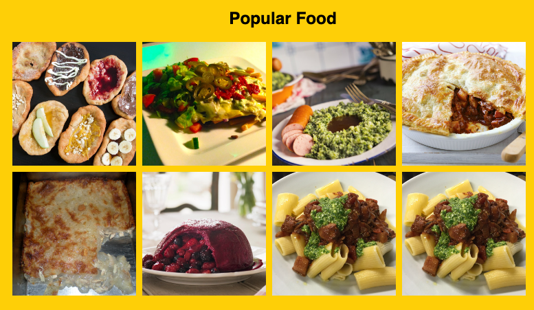

# Recipe Sharing
Project was designed to help use use the skills we have learned so far in js, css, json, html, Also got to learn how it would be to work in a team.

## website
http://127.0.0.1:5501/index.html# 

## Team Members 
1. Tomas Rullan
2. Basit Malik
3. Ranil Dissanayaka
4. Damion Morgan 
   
## UserStory
### As a user I want a webpage that I can use to  find new recipes, and look at the  most popular ones 

- Given a webpage meets accessibility standards.
- When I look at the webpage
- Then I see recipes in three different categories 
- When I click one category i see popular recipes 
- Then I can see the best form what people think
- When I go into the next categorie 
- Then I see what people say are the best 
- When I go into recipes categorie 
- Then I see all categories 

## How to use
- Click on any of the random recipe pictures on the main page to look at the info
- Click the about us to see information about the creators
- Click the search nav bar to go to a search page and search recipes
- Once in the search page just type a food item or recipe and click enter and click a recipe to bring you to the recipe page

  
 ## Resources
 
### Features Used
Js, Css, Json, Html

### API
1. [The MealDB](https://www.themealdb.com/)
2. [Edamam](https://api.edamam.com/)
### FrameWork
1. [Materialize](https://materializecss.com/)
### App Images
#### Home Page
Desktop

 

##### Tablet

##### Phone

#### Search Page
Desktop

##### Tablet and Phone 

#### About Us Page
Desktop

##### Tablet and Phone 

